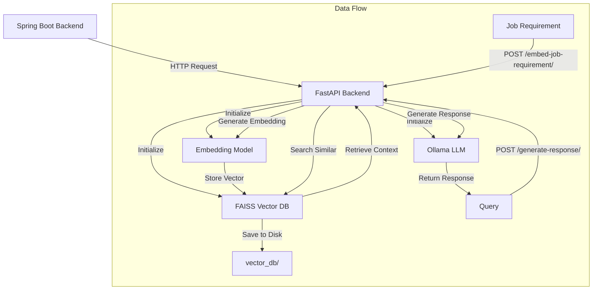
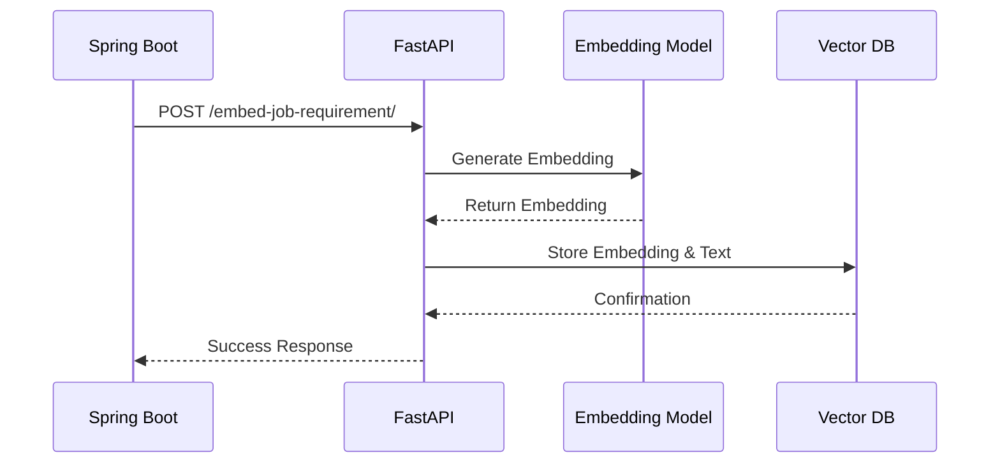
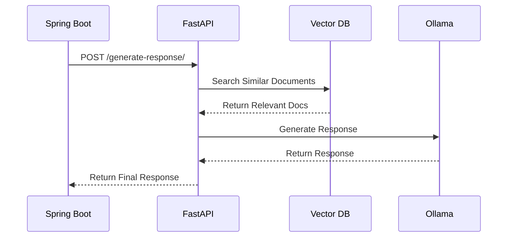

# RAG System Workflow Documentation

## System Architecture



## Component Details

### 1. FastAPI Backend (`app.py`)
- **Initialization**
  - Loads embedding model on startup
  - Initializes FAISS vector database
  - Sets up API endpoints

- **Endpoints**
  - `/embed-job-requirement/`: Stores job requirements
  - `/generate-response/`: Generates responses using RAG

### 2. Vector Database (`vector_db.py`)
- **Storage**
  - `faiss_index.bin`: FAISS index with embeddings
  - `doc_mappings.pkl`: Document ID to index mappings
  - `job_texts.pkl`: Original job descriptions

- **Operations**
  - `initialize_index()`: Creates new FAISS index
  - `add_embeddings_to_index()`: Stores embeddings and texts
  - `search_index()`: Finds similar documents
  - `save_index()`: Persists data to disk
  - `load_index()`: Loads data from disk

### 3. Embedding Model (`embedding.py`)
- **Functions**
  - `initialize_embedding_model()`: Loads the model
  - `get_embedding()`: Generates embeddings for text

### 4. Response Generator (`generator.py`)
- **Functions**
  - `generate_response()`: Calls Ollama API
  - `check_ollama_connection()`: Verifies API availability

## Data Flow

### 1. Storing Job Requirements


### 2. Generating Responses


## File Structure
```
.
├── app.py              # FastAPI application
├── vector_db.py        # FAISS vector database operations
├── embedding.py        # Embedding model operations
├── generator.py        # Ollama API integration
├── requirements.txt    # Python dependencies
└── vector_db/         # Persistent storage
    ├── faiss_index.bin
    ├── doc_mappings.pkl
    └── job_texts.pkl
```

## Error Handling
- Connection checks for Ollama API
- Retry logic for failed requests
- Proper error messages for:
  - Missing files
  - Invalid embeddings
  - API timeouts
  - Database errors

## Data Persistence
- All vector database components are saved to disk
- Data persists across application restarts
- Automatic loading of existing data on startup 